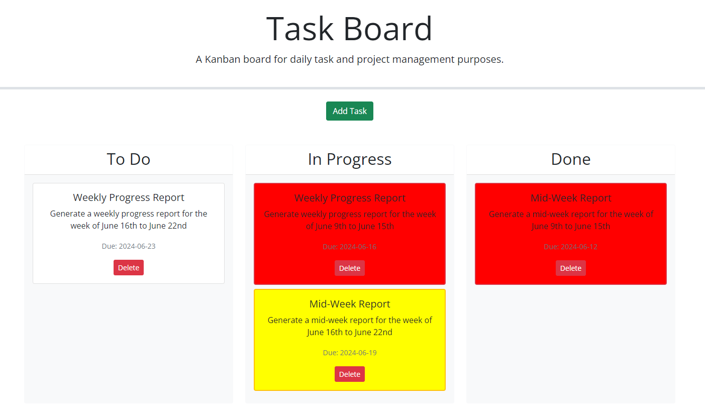

# Task-Board

## Description
The purpose of this application was to create a simple task board application that allows teams to manage project tasks. The user is able to keep track of due dates and progress for each item.

This app runs in the browser and feature dynamically updated HTML and CSS powered by jQuery.

## Table of Contents
- [Installation](#installation)
- [Usage](#usage)
- [License](#license)
- [Contributing](#contributing)
- [Tests](#tests)
- [Questions](#questions)

## Installation
NA

## Usage
https://nhl1090.github.io/Task-Board/

## License
This project is licensed under the .

## Contributing

- Date-Fns
    - (https://date-fns.org/)
- Day.js
    - (https://day.js.org/)
- edX
    - (https://www.edx.org/)
- Get Bootstrap
    - (https://getbootstrap.com/)
- GitHub
    - (https://moment.github.io/luxon/#/)
    - (https://js-joda.github.io/js-joda/)

- Google
    - (https://fonts.google.com/)
- jQuery
    - (https://jquery.com/)
    - (https://api.jquery.com/)
    - (https://api.jquery.com/category/traversing/)
    - (https://api.jquery.com/category/events/)
- jQuery User Interface
    - (https://jqueryui.com/)
- MDN 

- Mimo
    - (https://mimo.org)
- Open Source Initiative
    - (https://opensource.org/license/MIT)
- Stackoverflow
    - (https://stackoverflow.com/)
- W3 Schools
    - (https://www.w3schools.com/)
- Wikipedia
    - (https://en.wikipedia.org/wiki/Website_wireframe)

https://day.js.org/en/
https://github.com/coding-boot-camp/musical-happiness
https://fonts.google.com/
https://jqueryui.com/demos/
https://day.js.org/
https://jquery.com/
https://getbootstrap.com/docs/5.1/getting-started/introduction/
https://fonts.google.com/
https://jqueryui.com/
https://day.js.org/
https://moment.github.io/luxon/#/
https://date-fns.org/
https://js-joda.github.io/js-joda/
https://api.jquery.com/category/traversing/
https://api.jquery.com/category/events/
https://getbootstrap.com/docs/5.1/getting-started/introduction/
https://api.jquery.com/

## Tests
NA

## Questions
For any questions, please reach out to me at [nhl1090](https://github.com/nhl1090). Thank you!